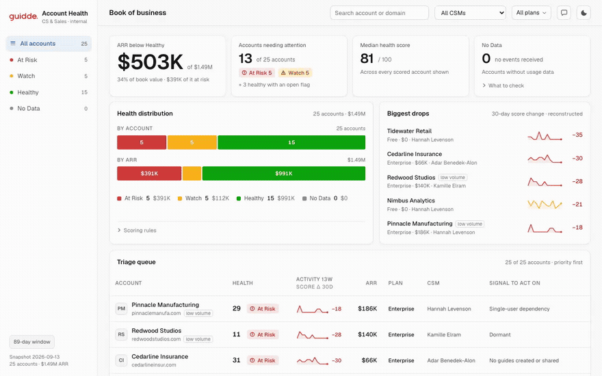

# Account Health Dashboard

An internal dashboard for CS and Sales: which accounts are healthy, which are at risk, which
conversation to have first, and the evidence behind every verdict.

Built from `accounts.json` and `usage_events.json` as a full pipeline — raw export → normalized
SQLite → API → Next.js UI.

📄 **[ANALYSIS.md](ANALYSIS.md)** — what the data contains, every threshold and why, the severity
model, edge cases, assumptions, and open questions. `/data-quality` shows the same report live.



## Quick start

```bash
npm install
npm run dev          # runs the ingest pipeline first, then starts on :3000
```

Node 22.5+ is required (the storage layer uses the built-in `node:sqlite`, so there is no native
build step and no database dependency to install).

| Command | What it does |
|---|---|
| `npm run dev` | Ingests, then serves on `localhost:3000` |
| `npm run ingest` | Rebuilds `data/health.db` and prints the data-quality report |
| `npm test` | 39 tests: the scoring model, the edge cases, and a SQL cross-check of the stored results |
| `npm run build` / `npm start` | Production build |

Four pages: **`/`** the triage queue, **`/accounts/[slug]`** the drill-down,
**`/method`** how the score works, **`/data-quality`** what the pipeline checked and found. Four
API routes (`/api/accounts`, `/api/accounts/[slug]`, `/api/portfolio`, `/api/data-quality`) expose
the same reads for external consumers — the pages themselves call `src/lib/db.ts` directly,
server-side, so the page and the API can never disagree.

## Ask the data

A chat panel (the icon next to the theme toggle) answers questions like *"which accounts are At
Risk and why?"* or *"why is Pinnacle Manufacturing scored the way it is?"*, grounded entirely in
the same computed data the dashboard shows — see [Chat assistant](#chat-assistant) below for how.

Optional: works with no key at all. To enable it, get a free key (no credit card) at
[aistudio.google.com/apikey](https://aistudio.google.com/apikey) and add it to `.env.local`:

```bash
cp .env.local.example .env.local
# then paste your key into GEMINI_API_KEY=
```

## What "account health" means here

**Health is computed from product usage and nothing else.** Four measures, 100 points, and three
facts the arithmetic is not allowed to outvote.

| Pillar | Points | Measures |
|---|---|---|
| **Recency** | 30 | Days since the last event |
| **Breadth** | 25 | Distinct users active in the last 30 days |
| **Depth** | 25 | Guides created (×2) and shared in the last 30 days |
| **Consistency** | 20 | Active weeks out of the last 8 |

`Healthy ≥ 75 · Watch 45–74 · At Risk < 45 · No Data when no events were received.`

Three facts cap the tier after the arithmetic, so a strong score can never hide them: **silent for
30+ days → At Risk**, **never created or shared a guide → not Healthy**, **one active user or
fewer → not Healthy**. Every point and every cap prints the one sentence it's made of — see
[ANALYSIS.md](ANALYSIS.md) for the full model, the severity derivation, and why ARR and trend are
deliberately kept out of the score.

## Architecture

```
data/*.json          the raw export, unmodified
  ↓ scripts/ingest.ts
src/lib/normalize.ts canonicalize, join, validate → DataQualityReport
src/lib/metrics.ts   per-account metrics          (pure)
src/lib/health.ts    pillars → score → overrides → tier  (pure)
src/lib/risks.ts     risk detection + severity derivation (pure)
  ↓ src/lib/db.ts
data/health.db       SQLite: flat columns for filtering, JSON for evidence payloads
  ↓
/api/*  →  Next.js UI
```

Health is computed once during ingest and stored — the API serves a verdict rather than
recomputing one, so the UI and the database can never drift apart, and `sqlite3 data/health.db`
re-derives every number with plain SQL. Every threshold lives in `src/lib/config.ts` next to the
reason it was chosen, and `/method` renders that file directly. The scoring stages are pure
functions, which is what lets `tests/pipeline.test.ts` cross-check the stored results against a
fresh in-memory run.

## Chat assistant

"Ask the data" is a small tool-calling loop against the Gemini API, not a second model of the
data:

- **`src/lib/chat-tools.ts`** — four read-only functions (`list_accounts`, `get_account_detail`,
  `get_portfolio_summary`, `get_data_quality`), each a thin wrapper over `src/lib/db.ts` — the same
  read path the pages use. The model never computes a score or a risk; it can only ask for numbers
  the ingest pipeline already produced and report them. `get_account_detail` fuzzy-resolves a
  company name, slug, or domain, and returns "no match" or a disambiguation list rather than
  guessing.
- **`src/app/api/chat/route.ts`** — a manual function-calling loop (`gemini-flash-latest` by
  default, overridable via `GEMINI_MODEL`). Stateless per request: only plain user/assistant text
  is kept on the client and resent each turn; the functionCall/functionResponse exchange for a
  single turn lives and dies inside that one request, so there is nothing else to persist.
- **`src/components/chat.tsx`** — the panel itself, built from the same drawer/button primitives
  already used by the data-quality drawer and the theme toggle, so it introduces no new visual
  language.

With no `GEMINI_API_KEY` set, the rest of the dashboard is unaffected — the panel just explains how
to add one instead of answering.
